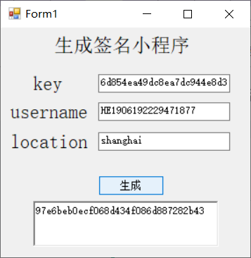
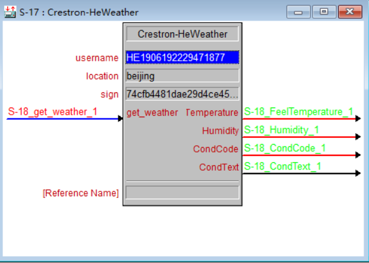

## 快思聪对接和风天气
**原理：** 使用http协议对和风天气的API进行请求，得到响应后，将数据解析出来就好，本项目使用的是基本版的API，只获取了*温度*，*湿度*，*天气代码*，*天气情况*。

**参考资料** [和风天气API](https://dev.heweather.com/docs/api/weather)

获取北京天气返回的数据
```
{
  "HeWeather6": [
    {
      "basic": {
        "cid": "CN101010100",
        "location": "北京",
        "parent_city": "北京",
        "admin_area": "北京",
        "cnty": "中国",
        "lat": "39.90498734",
        "lon": "116.4052887",
        "tz": "+8.00"
      },
      "update": {
        "loc": "2019-10-23 14:30",
        "utc": "2019-10-23 06:30"
      },
      "status": "ok",
      "now": {
        "cloud": "10",
        "cond_code": "100",
        "cond_txt": "晴",
        "fl": "19",
        "hum": "38",
        "pcpn": "0.0",
        "pres": "1012",
        "tmp": "21",
        "vis": "16",
        "wind_deg": "358",
        "wind_dir": "北风",
        "wind_sc": "2",
        "wind_spd": "10"
      }
    }
  ]
}
```

#### 如何使用
1. 注册和风天气账号，添加一个应用。然后获得key，username等数据。

2. 使用获取签名程序（getSign.exe），获取签名（sign）。


3. 将clz文件放到和宏一个文件目录下（基本操作，不会导入的去面壁），编译，编译的时候有可能报错，重新点下3系列主机就行（这个软件bug浪费我很多时间。。。）

4. 在宏里填写username，location，sign。


5. 进行测试
